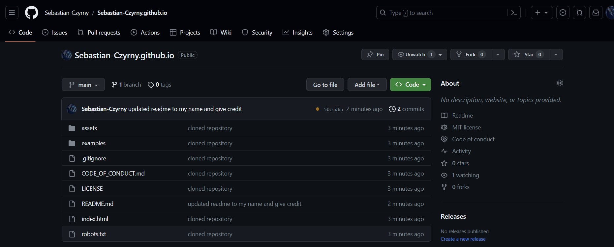
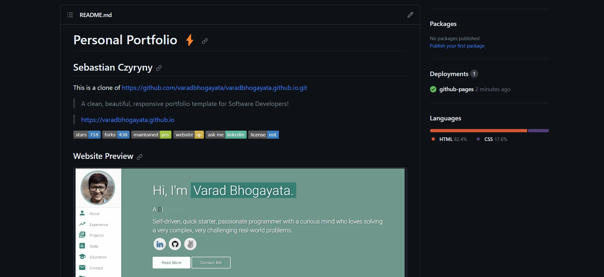
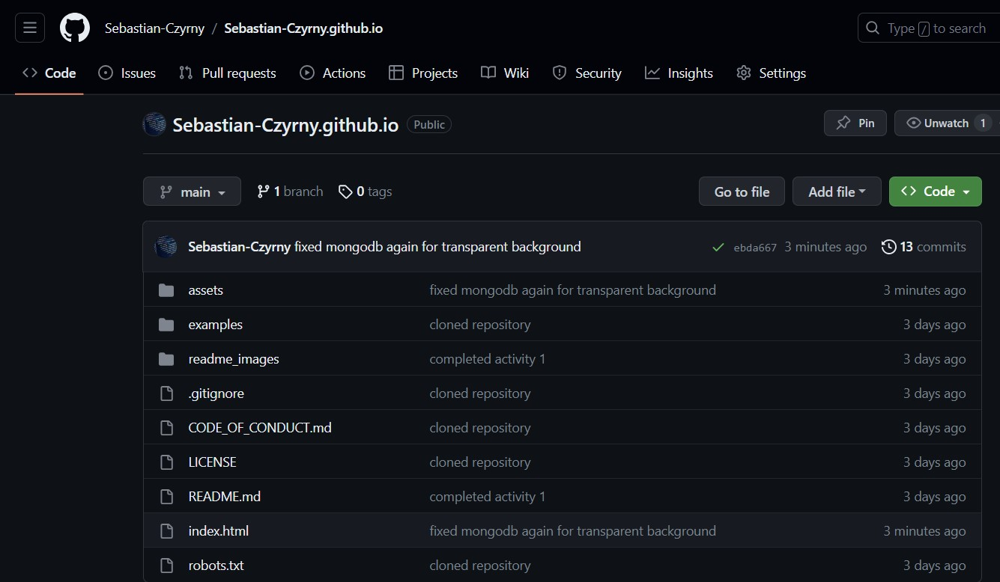
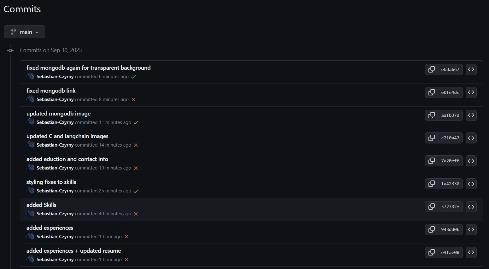
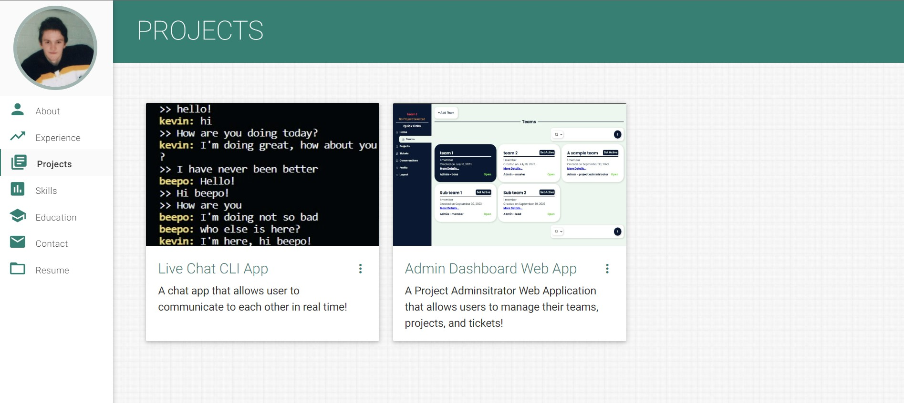
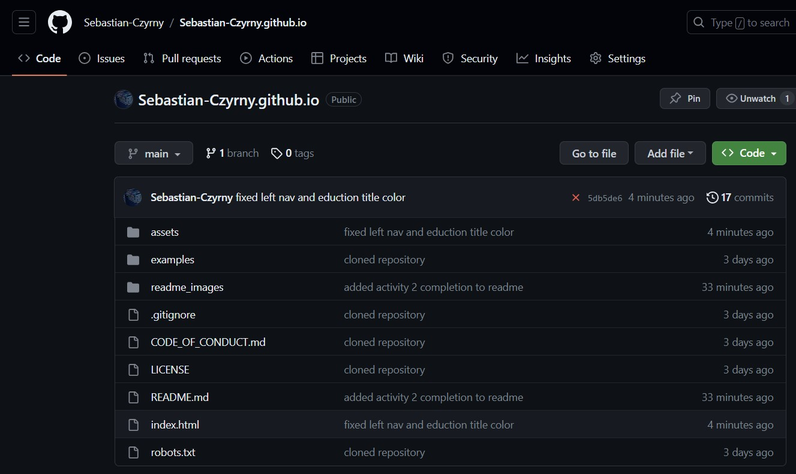
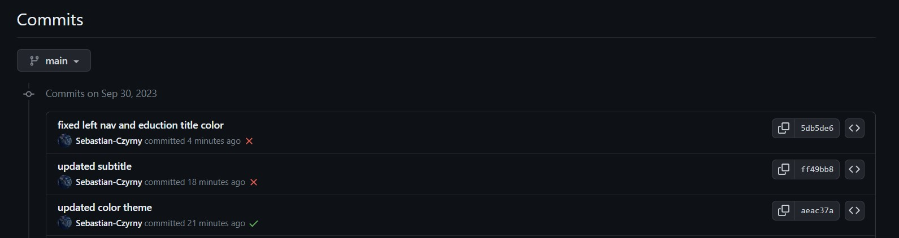
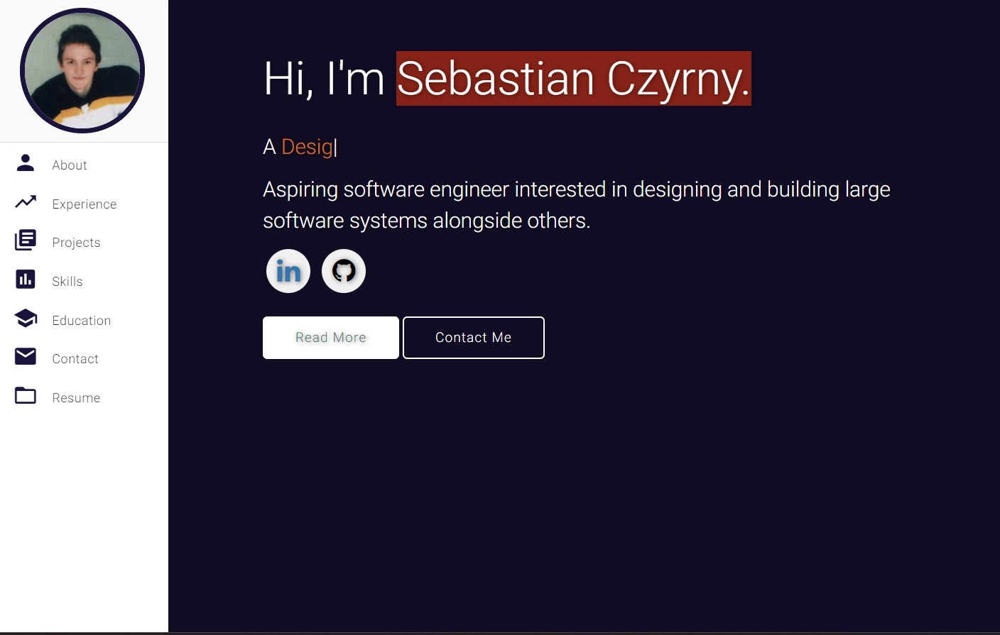
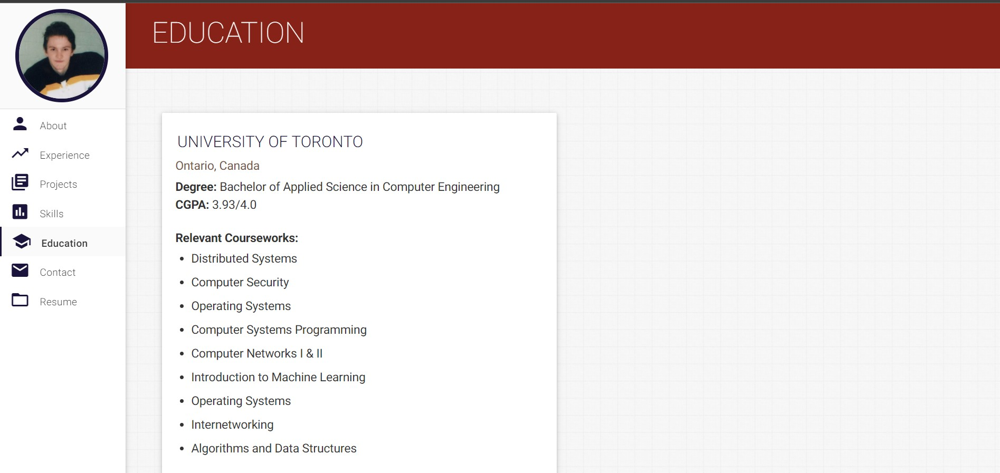

# Personal Portfolio ⚡️ 
## Sebastian Czyryny

This repo is a clone of https://github.com/varadbhogayata/varadbhogayata.github.io

# Activity 1: Cloning personal website repo

The below is an image of my own repository after cloning

# Activity 2: Adding Personal Information 

The below are images regarding the addition of my personal information and the site

## Repo

The below is an image of the repo:

The below is an image of the commit history:

## Deployed Site

The below is an image of the about page:

The below is an image of the projects page:

# Activity 3: Changing Color theme 

The below are images regarding the update of the color theme

## Repo

The below is an image of the repo:

The below is an image of the commit history:

## Deployed Site

The below is an image of the front page:

The below is an image of the eduction page:

